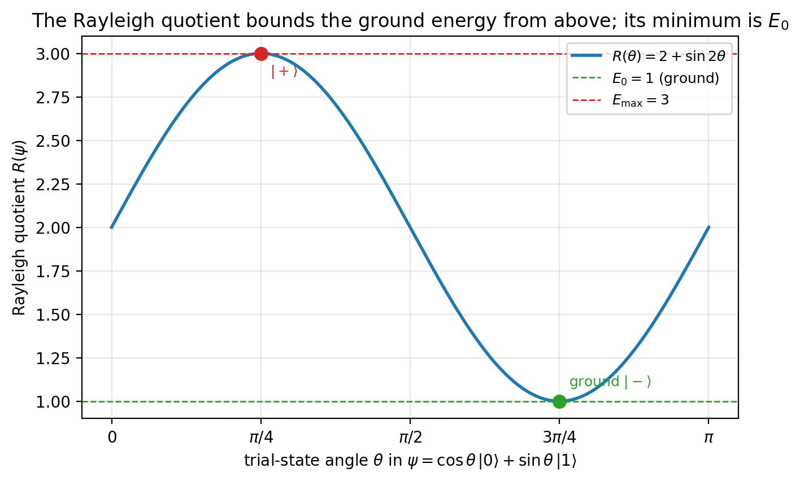
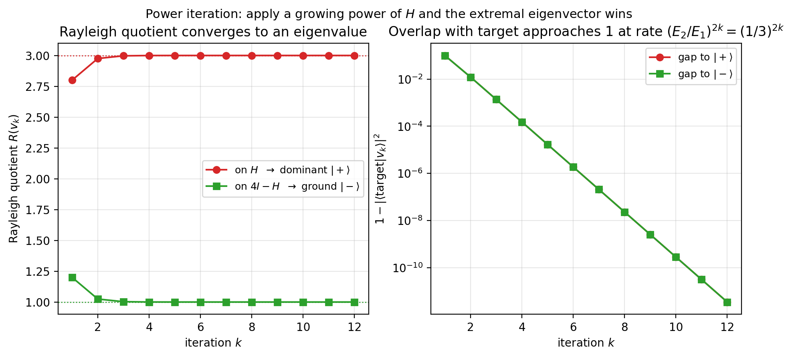
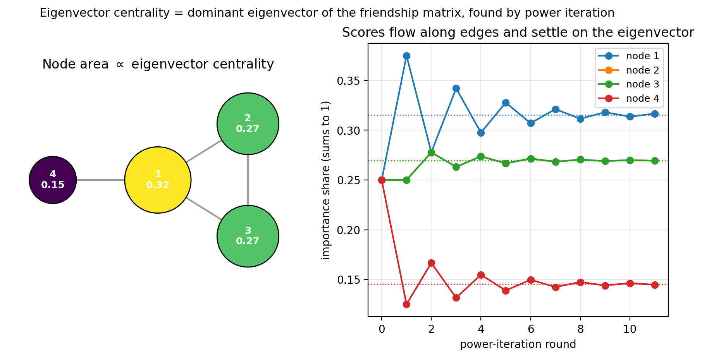
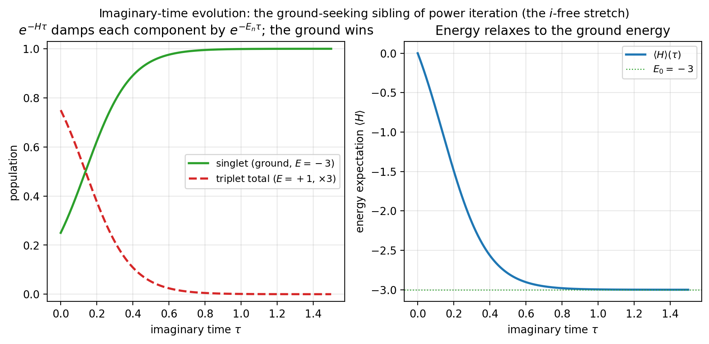
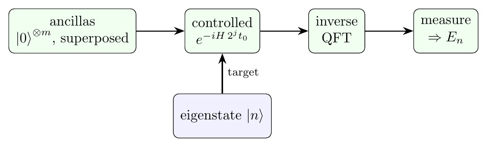
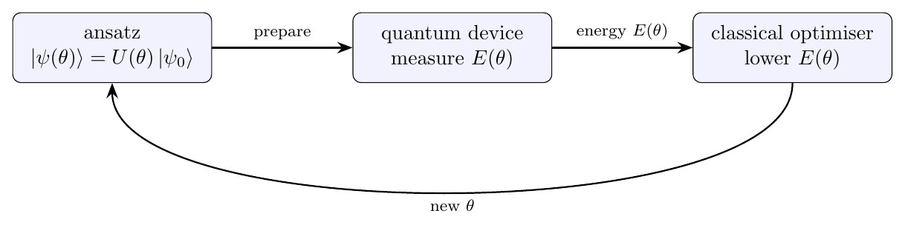
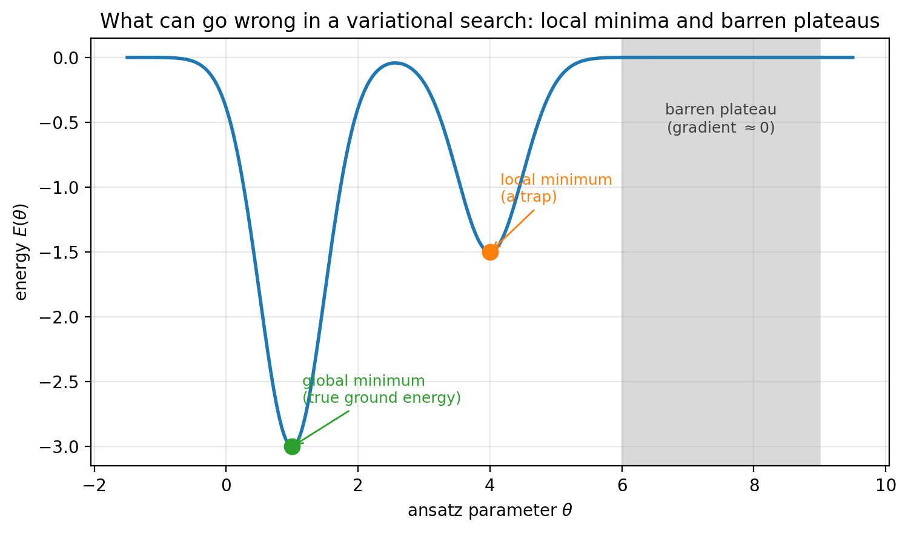

# Machine Learning and Quantum Computing: What a Difference `i` Makes

*Power iteration ranks web pages. Imaginary time cools a quantum system. Phase estimation reads an energy off a circuit. They are all one move: apply a function of the operator $H$ and let the spectrum sort itself out. The only thing separating the machine-learning half of that sentence from the quantum half is a single factor of $i$.*

<!-- more -->

!!! note "Part 2 of *Linear Algebra for Fun and Profit*"
    Part 1, **How to Raise `e` to a Matrix**, builds the machinery this post spends: the matrix exponential, the spectral theorem, and why $e^{-iHt}$ is a rotation. Read that first if $\lvert n\rangle\langle n\rvert$ or "functions of $H$" are unfamiliar.

## The one idea

Every eigensolver in this post is a way of applying a **function of $H$** to filter its spectrum. Three functions recur:

- a growing power or exponential, $H^k$ or $e^{+Ht}$, which **stretches** the spectrum and amplifies an extremal eigenvector;
- the propagator $e^{-iHt}$, which **rotates** and exposes eigenvalues as phases to be read;
- the Rayleigh quotient, which turns "find the lowest eigenvalue" into "minimise a function."

The stretch is the engine of power iteration, Lanczos, and imaginary-time preparation; it is also, with the $i$ removed, the engine of PageRank and principal component analysis. The rotation is the engine of quantum phase estimation. That is the whole map, and the punchline is that the difference between the two is exactly the $i$ in the exponent.

## What this post covers

This is the companion walkthrough to a longer piece; the full text (eigenproblem, the variational principle, the classical eigensolvers, phase estimation, imaginary-time and adiabatic preparation, and the variational quantum eigensolver) is being adapted here and lands before publication. The figures below are the spine of it.

*Draft in progress; full prose lands before the 21 July publication date.*
